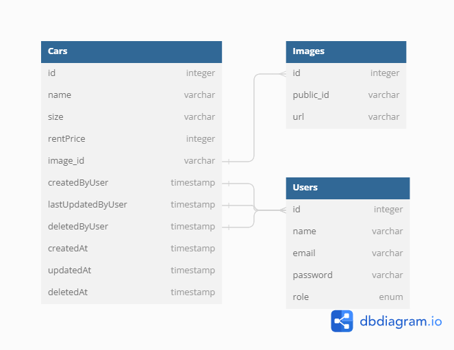

# Binar: Challenge 05 OAuth and API Documentation 
Fullstack Web Development Challenge 5 Binar Academy - FSW2402KM6004 Andhika Rizky Aulia  

A Car Rent Management REST API using express.js and postgreSQL as the database. Have CRUD operation, with image upload function and Authorization

-----------------------
# How to Use
1. `git clone https://github.com/ndikrp/f-fsw24001086-km6-and-auth-ch5.git`
2. `npm install` to install all the dependencies
3. Create a .env file and make it match the .env.example file in root directory
4. Configure .env according to your credentials
5. Make sure [PostgreSQL](https://www.postgresql.org/download/) is installed and running on your computer
6. run script `npm run database-config` to create database, migrate, and seed database in your PostgreSQL or you can execute it one by one (look at the package.json for the script)
- (OPTIONAL) seeder contain the admin credential
              - run undo seed script `npm run undo-seed` to undo the seeders
7. run `npm run start` to run the server
8. Done

-----------------------
# Database Design

-----------------------

# Dependencies
* [express](https://www.npmjs.com/package/express) (API Framework)
* [jsonwebtoken](https://www.npmjs.com/package/jsonwebtoken) (Encrypt Credential)
* [nodemon](https://www.npmjs.com/package/nodemon) (For easy development)
* [morgan](https://www.npmjs.com/package/morgan) (For the middleware)
* [eslint](https://www.npmjs.com/package/eslint) (Just for indentation and linebreak style)
* [dotenv](https://www.npmjs.com/package/dotenv) (To load environtment variables from `.env`)
* [multer](https://www.npmjs.com/package/multer) (To handle `multipart/form-data`)
* [pg](https://www.npmjs.com/package/pg) (Non-blocking PostgreSQL client for Node.js)
* [pg-hstore](https://www.npmjs.com/package/pg-hstore) (A node package for serializing and deserializing JSON data to hstore format)
* [sequelize](https://www.npmjs.com/package/sequelize) (ORM tool for PostgreSQL and other dbs)
* [cloudinary](https://www.npmjs.com/package/cloudinary) (optimize, transform, upload and manage file/image to cloudinary)
* [bcrypt](https://www.npmjs.com/package/bcrypt) (To hash password)
* [swagger-ui-express](https://www.npmjs.com/package/swagger-ui-express) (serve auto-generated swagger-ui generated API docs from express)
